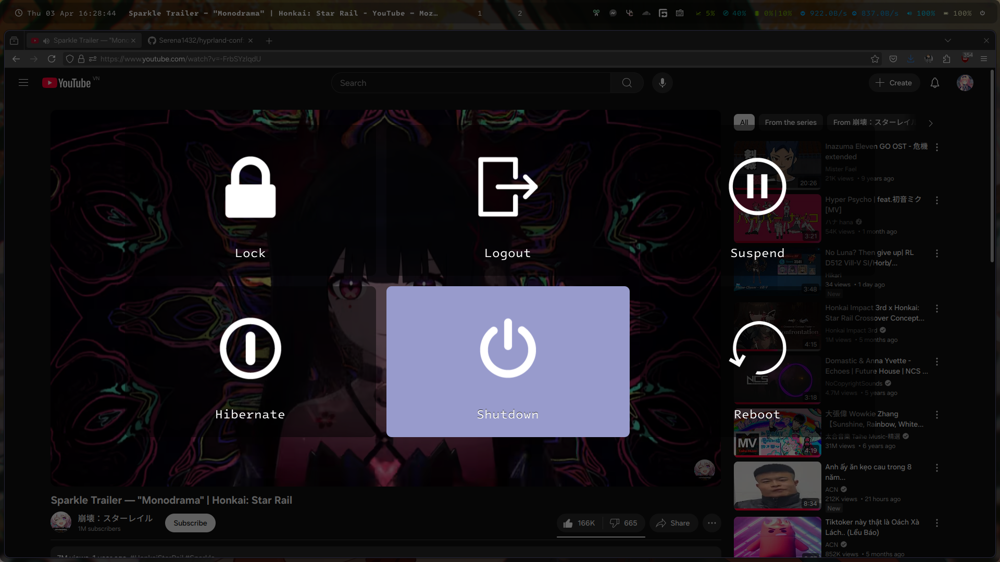

# hyprland-conf

This is the backup files for my Hyprland configuration. Of course it's here for preservation purposes only, but if anyone is willing to use or modify them, you can do it because why not?

## Computer specifications

* **Laptop:** Acer Nitro AN515-57-5669
* **CPU:** 11th Gen Intel(R) Core(TM) i5-11400H @ 2.70GHz
* **GPU:** Intel(R) UHD Graphics (Tiger Lake) / NVIDIA GeForce GTX 1650 (Turing/TU117M)
* **RAM:** 16.0 GB
* **SSD:** SK Hynix BC711 HFM512GD3JX016N (512 GB) / KIOXIA KBG30ZMV256G (unused on Linux)
* **HDD:** WDC WD7500BPVX-7 (750 GB)
* **Trackpad:** ELAN TouchPad (I2C)
* **Audio Codec:** Realtek ALC295
* **Wi-Fi:** Killer(R) Wi-Fi 6 AX1650i 160MHz Wireless Network Adapter (201NGW)
* **Ethernet:** Killer E2600 Gigabit Ethernet Controller
* **BIOS:** InsydeH20 V1.20 (UEFI)

## Settings

I used all of these things for my Hyprland configuration:

* `hyprpaper` (wallpaper) `~/.config/hypr/hyprpaper.conf`
* `hyprlock` (lockscreen) `~/.config/hypr/hyprlock.conf`
* `kitty` (terminal) `~/.config/kitty/kitty.conf`
* `mako` (notification daemon) `~/.config/mako/config`
* `waybar` (status bar) `~/.config/waybar/config.jsonc`
* `wofi` (status bar) `~/.config/wofi/config.rasi`
* `uwsm`  `~/.config/uwsm/env-hyprland`
* `qt5ct/qt6ct` (Qt apps theme config) `~/.config/qt(5|6)ct/qt(5|6)ct.conf`
* `gtk-3.0/gtk-4.0` (GTK apps theme config) `~/.config/gtk-(3|4).0/settings.ini`
* `kvantum` (Qt apps theme config) `~/.config/Kvantum/kvantum.kvconfig`
* `fontconfig` (more beautiful font rendering) `~/.config/fontconfig/fonts.conf`
* `hyprpolkitagent` (GUI authentication)
* `gpu-usage-waybar` (GPU usage script)
* `cliphist` (clipboard history)
* `copyq` (clipboard manager)
* `playerctl` (media player control)
* `thunar` (file manager)
* `wofi-emoji` (emoji keyboard)
* `grim` (screenshot)
* `brightnessctl` (brightness control)
* `wlogout` (GUI power menu)
* `gnome-power-statistics` (GUI power management)
* `pavucontrol` (audio control)
* `pamixer` (audio control)
* `nvtop` (graphics statistics)
* `htop` (system statistics)
* `psensor` (GUI sensor statistics)
* `wayland-logout` (logout helper)
* `network-manager-applet` (NetworkManager applet)

## Installation

* Download this repository.

* Copy all files in the folder to your home directory, and then tweak it for your need.

## Fonts

I mainly use `One UI Sans APP VF` (Samsung's new One UI font) and `Intel One Mono` for setting the font.

Due to licensing, I can't share the fonts here. You should find it yourself and put it to `~/.local/share/fonts`.

## Changing color palette/wallpaper

I've made changing color palette through Hyprland easier through presets.

Due to each application having different configuration, you should refer to the `README.md` file of each respective application in the `.config` folder:

* [hypr ecosystem](.config/hypr/README.md)
* [mako](.config/mako/README.md)
* [wlogout](.config/wlogout/README.md)
* [wofi](.config/wofi/README.md)

## About `fancontrol.sh`

That is just a small script I used for controlling the laptop fan more easily, and bind it to the NitroSense button.

Of course this isn't a full NitroSense replacement, but at least it serves the purpose of changing the fan speed.